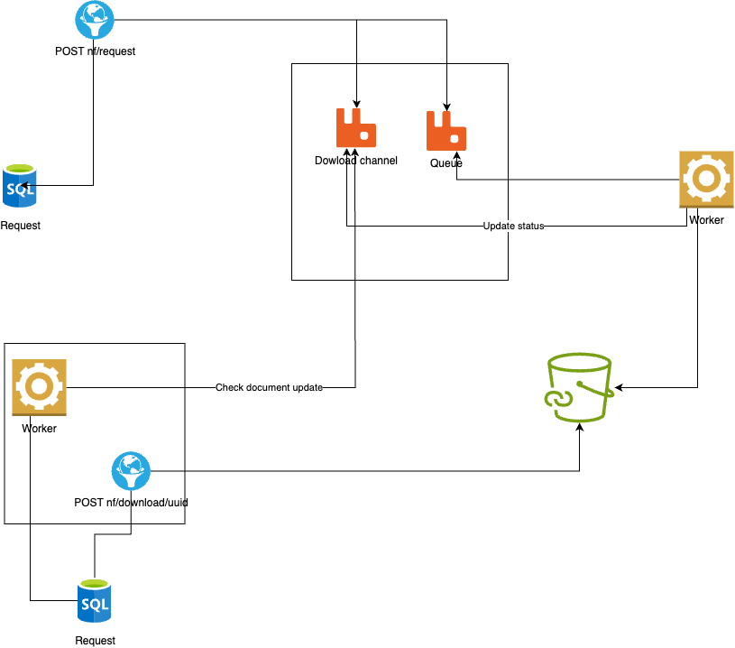

#

## Workflow

### Workflow V1


### Workflow V2



### Current Workflow


## dependences

- node
- golang
- yarn

## run project

Run infra local

```sh
docker-compose up -d
```

Endpoint of new requests (this project use clean archtecture)

```sh
cd nf_request && yarn dev

```

Worker to generate files (pdf)

```sh
cd worker_create_pdf && go run cmd/worker/main.go

```

Worker to create new entity on dowload service

```sh
cd download && yarn worker:dev

```

http service to present file and recive status update when file is available

```sh
cd download && yarn server:dev

```
